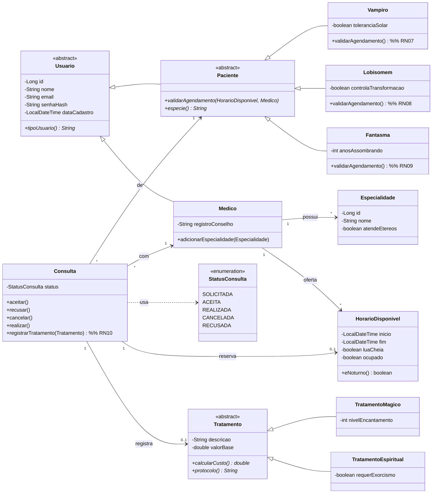

# Modelagem — MedMonstros

## Diagrama de Classes

```mermaid
classDiagram
    direction LR

    class Usuario {
        <<abstract>>
        -Long id
        -String nome
        -String email
        -String senhaHash
        -LocalDateTime dataCadastro
        +tipoUsuario()* String
    }

    class Paciente {
        <<abstract>>
        +validarAgendamento(HorarioDisponivel, Medico)*
        +especie()* String
    }
    class Vampiro {
        -boolean toleranciaSolar
        +validarAgendamento() %% RN07
    }
    class Lobisomem {
        -boolean controlaTransformacao
        +validarAgendamento() %% RN08
    }
    class Fantasma {
        -int anosAssombrando
        +validarAgendamento() %% RN09
    }

    class Medico {
        -String registroConselho
        +adicionarEspecialidade(Especialidade)
    }
    class Especialidade {
        -Long id
        -String nome
        -boolean atendeEtereos
    }
    class HorarioDisponivel {
        -LocalDateTime inicio
        -LocalDateTime fim
        -boolean luaCheia
        -boolean ocupado
        +eNoturno() boolean
    }

    class Consulta {
        -StatusConsulta status
        +aceitar()
        +recusar()
        +cancelar()
        +realizar()
        +registrarTratamento(Tratamento) %% RN10
    }
    class StatusConsulta {
        <<enumeration>>
        SOLICITADA
        ACEITA
        REALIZADA
        CANCELADA
        RECUSADA
    }

    class Tratamento {
        <<abstract>>
        -String descricao
        -double valorBase
        +calcularCusto()* double
        +protocolo()* String
    }
    class TratamentoMagico {
        -int nivelEncantamento
    }
    class TratamentoEspiritual {
        -boolean requerExorcismo
    }

    Usuario <|-- Paciente
    Usuario <|-- Medico
    Paciente <|-- Vampiro
    Paciente <|-- Lobisomem
    Paciente <|-- Fantasma
    Tratamento <|-- TratamentoMagico
    Tratamento <|-- TratamentoEspiritual

    Medico "1" --> "*" Especialidade : possui
    Medico "1" --> "*" HorarioDisponivel : oferta
    Consulta "*" --> "1" Paciente : de
    Consulta "*" --> "1" Medico : com
    Consulta "1" --> "0..1" HorarioDisponivel : reserva
    Consulta "1" --> "0..1" Tratamento : registra
    Consulta ..> StatusConsulta : usa
```

